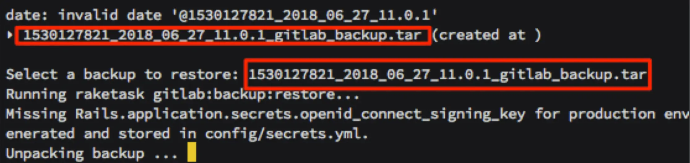

bear-docker-gitlab-ce
====================================================

## What's this:

Gitlab-ce + Gitlab-Runner for docker-compose


## How to and other docker-compose use the same network :

```
#if you not have group network, you can create this, and other docker-compose use this network setting
~ $ docker network create --driver bridge service_group
```

## How to start gitlab :

```
~/ $ git clone https://github.com/imagine10255/bear-docker-gitlab-ce gitlab
~/ $ cd gitlab
~/gitlab $ vi docker-compose.yml

```
Change your setting

Create your ssl cert


```
~/gitlab $ docker-compose up -d
```

Check root password
```
docker exec -it gitlab grep 'Password:' /etc/gitlab/initial_root_password
```

## How reset root password

```bash
$ docker ps
$ docker exec -it gitlab bash <= that is my container name in step 1
$ gitlab-rails console -e production <= wait, minutes for another prompt to come
$ user = User.where(id: 1).first
$ user.password = 'secret_pass' <= use your favorite password
$ user.password_confirmation = 'secret_pass' <= again
$ user.save! <= save user
```

## How to backup gitlab :

```
$ crontab -e

# backup gitlab
30 01 * * * /bin/sh /home/{your_username}}/gitlab/auto_backup.sh > /home/{your_username}/services/gitlab/cronlog.txt 2>&1
```

path: `/mnt/volume_sgp1_01/gitlab/data`


## How to restore

restore before, check your container is stop ($ docker-compose down)

```
# List available backups
~/gitlab $ docker-compose run --rm gitlab app:rake gitlab:backup:restore
```


Then you can start


## How to reset password by admin:

```
$ docker exec -it {your_gitlab_contanier_id} /bin/bash
$ su - git
$ cd gitlab
$ bundle exec rails c production
$ user = User.where(id: 1).first
$ user.password = 'NEW_PASS'
$ user.password_confirmation = 'NEW_PASS'
$ user.save
$ exit
```


## How to reset init:

How to clear all data, re init (clear volume)

```
~/imdock-gitlab-ci $ docker-compose down -v
```


## How to register runner :

before you need up runner

```
~/imdock-gitlab-ci/runner $ docker-compose up -d
```

then register runner

```
~ $ docker exec -it gitlab-runner-docker gitlab-runner register
# or
~ $ docker exec -it gitlab-runner-docker sh /home/gitlab-runner/shell/node-runner.sh

# qa
- key in {your-gitlab-host-setting}/ci
  ex : http://192.168.92.133:10080/ci or http://gitlab/ci
- key in {your-token}

- key in description (any)

- key in tag (any)

- key in executor
  ex : shell
```

got to the setting/pipelines check


## Ref
- [GitLab CI 上傳 Image 到 Google Container Registry](https://ithelp.ithome.com.tw/articles/10266998)
- [Update: Using Free Let’s Encrypt SSL/TLS Certificates with NGINX](https://www.nginx.com/blog/using-free-ssltls-certificates-from-lets-encrypt-with-nginx/)
- [攻略docker版Let's Encrypt憑證申請](https://www.ccc.tc/article/letsencrypt)