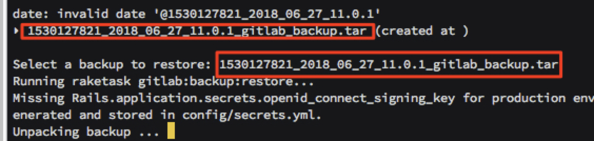

imdock-gitlab-ci
====================================================

## What's this:

Gitlab-ci + Gitlab-Runner for Docker-compose


## How to and other docker-compose use the same network :

```
#if you not have group network, you can create this, and other docker-compose use this network setting
~ $ docker network create --driver bridge imdockgroup
```

## How to start gitlab :

```
~/ $ git clone https://github.com/imagine10255/imdock-gitlab-ci.git
~/ $ cd imdock-gitlab-ci
~/imdock-gitlab-ci $ vi docker-compose.yml
# change GITLAB_HOST={YOUR IP} AND GITLAB_PORT,GITLAB_SSH_PORT
```

```
~/imdock-gitlab-ci $ docker-compose up -d
```

## How to backup gitlab :

default backup dir in container path [/home/git/data    /backups]

backup time by GITLAB_BACKUP_TIME

in docker-compose.yml has set volumes: [./backups:/home/git/data/backups]


backup before, check your container is stop ($ docker-compose down)

```
~/imdock-gitlab-ci $ docker-compose run --rm gitlab app:rake gitlab:backup:create
```

Then you can start


## How to restore

restore before, check your container is stop ($ docker-compose down)

```
# List available backups
~/imdock-gitlab-ci $ docker-compose run --rm gitlab app:rake gitlab:backup:restore
```


Then you can start


## How to reset password by admin:

```
$ docker exec -it {your_gitlab_contanier_id} /bin/bash
$ su - git
$ cd gitlab
$ bundle exec rails c production
$ user = User.where(id: 1).first
$ user.password = 'NEW_PASS'
$ user.password_confirmation = 'NEW_PASS'
$ user.save
$ exit
```


## How to reset init:

How to clear all data, re init (clear volume)

```
~/imdock-gitlab-ci $ docker-compose down -v
```


## How to register runner :

before you need up runner

```
~/imdock-gitlab-ci/runner $ docker-compose up -d
```

then register runner

```
~ $ docker exec -it gitlab-runner-docker gitlab-runner register
# or
~ $ docker exec -it gitlab-runner-docker sh /home/gitlab-runner/shell/node-runner.sh

# qa
- key in {your-gitlab-host-setting}/ci
  ex : http://192.168.92.133:10080/ci or http://gitlab/ci
- key in {your-token}

- key in description (any)

- key in tag (any)

- key in executor
  ex : shell
```

got to the setting/pipelines check
