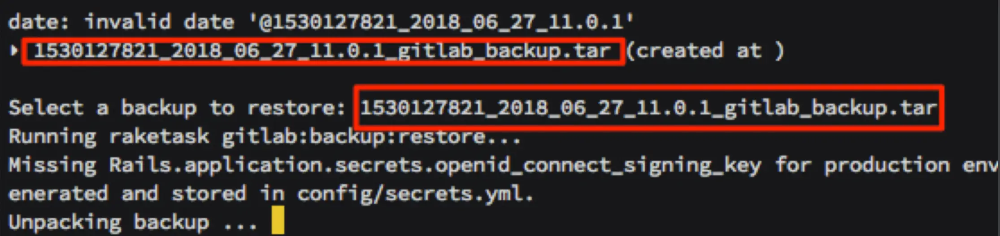

# Gitlab Backup & Restore

## How to backup gitlab :

```bash
$ crontab -e

# backup gitlab
30 01 * * * /bin/sh /home/{your_username}}/gitlab/auto_backup.sh > /home/{your_username}/services/gitlab/cronlog.txt 2>&1
```

path: `/mnt/volume_sgp1_01/gitlab/data`


## How to restore

restore before, check your container is stop ($ docker-compose down)

```bash
# List available backups
~/gitlab $ docker-compose run --rm gitlab app:rake gitlab:backup:restore
```


Then you can start
